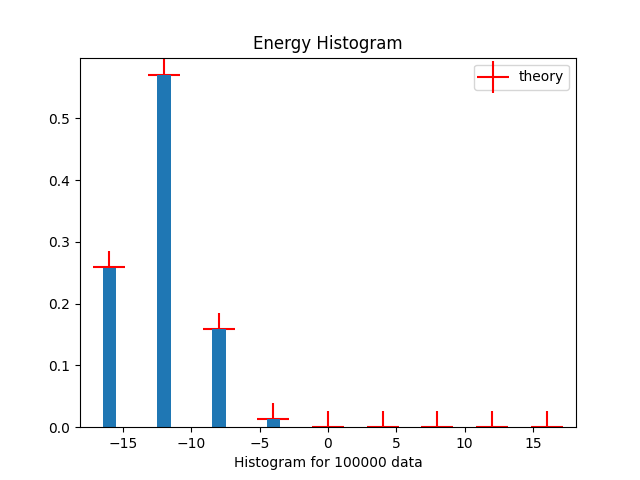

<h1 align="center"> Ising Model GAN</h1>

<h3>Generative Adversarial Network for one-dimensional Ising Model</h3> 

<h4>isingOne_v2.py</h4>
Convolutional networks generating data with a batch of 400, noise of length 1.

<h4>isingOne_Linear.py</h4>
Linear (Fully connected layers) network generating data with a batch of 200, noise of length 1.

<h4>testData.py</h4>
A file that tests the generated data and also produces graphs.

<h4>test.py</h4>
File testing original unprocessed data  

<h3 align="center">Charts of real data</h3>

|               Energy charts               |              Magnetization charts               |
|:-----------------------------------------:|:-----------------------------------------------:|
|               |              |
|       Energy Histogram for 400 data       |      Magnetization Histogram for 400 data       |
|      |      |
|      Energy Histogram for 2000 data       |      Magnetization Histogram for 2000 data      |
|  |  |

<h3 align="center">Charts of Generated data by isingOne_v2.py (Convolutional networks)</h3>

|           Energy charts           |           Magnetization charts           |
|:---------------------------------:|:----------------------------------------:|
|       |       |
|   Energy Histogram for 400 data   |   Magnetization Histogram for 400 data   |
|  |  |

<h3 align="center">Charts of Generated data by isingOne_Linear.py (Fully connected layers)</h3>

|                   Energy charts                    |                   Magnetization charts                    |
|:--------------------------------------------------:|:---------------------------------------------------------:|
|      |      |
|           Energy Histogram for 200 data            |           Magnetization Histogram for 200 data            |
|  |  |

