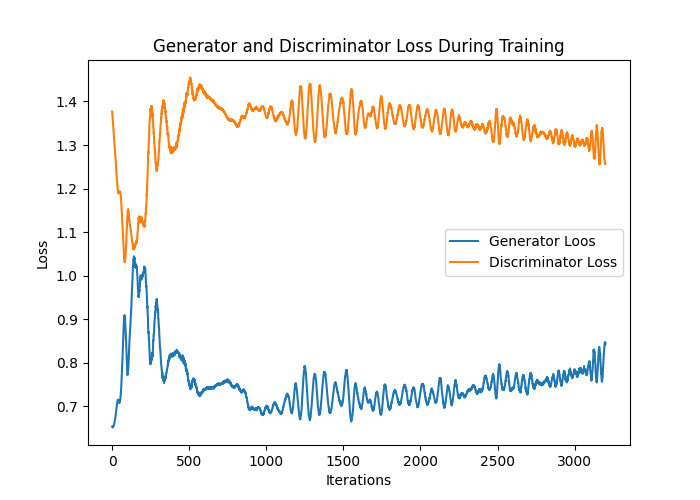
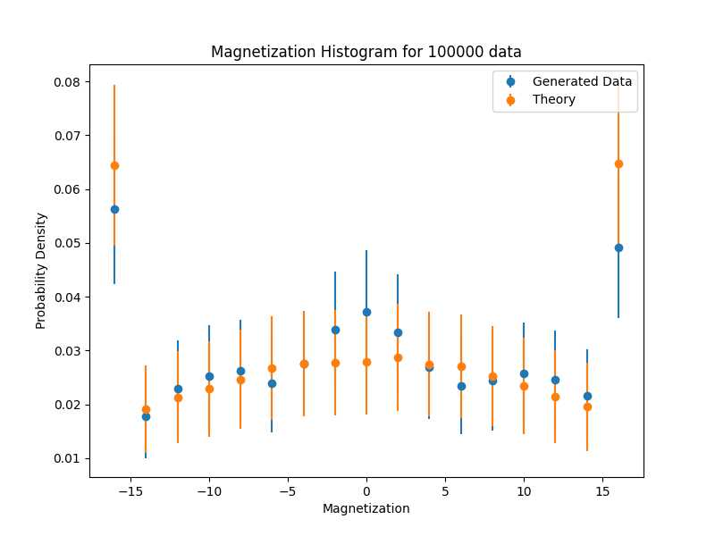

<h2  align="center">Configuration 16</h2>

<h3 align="center">Charts of Generated data by Linear Models - 200 epochs</h3> <h6 align="center">(Fully connected layers)</h6>

<h4>Beta: 0100</h4>

|                                  Input noise 1                                  |                          Input noise 2                          |                            Input noise 4                             |
|:-------------------------------------------------------------------------------:|:---------------------------------------------------------------:|:--------------------------------------------------------------------:|
|                  |                |                 |
|  |         |          |
|     |   |   |
|                                  Input noise 8                                  |                         Input noise 16                          |                            Input noise 32                            |
|                  |               |                |
|            |         |         |
|     |  |  |

 
 